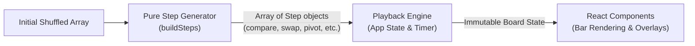

# algorithm-visualizer

An interactive web application that visualizes and compares sorting algorithms side by side in real time.

All algorithms sort the same shuffled dataset at the same playback speed, making it intuitive to observe differences in strategy, comparisons, and swap efficiency.

---

## Key Features

- **Side-by-Side Comparison**: Run multiple sorting algorithms simultaneously against identical input arrays.
- **Interactive Controls**: Play, pause, step forward, shuffle, and customize both array size (5–50 elements) and animation speed (0.2×–10×).
- **Dual Language & Theming**: Full Japanese / English localization (auto-detected with manual override) and responsive layouts.
- **Extensible Architecture**: Pure step-generator functions completely decoupled from the React rendering layer.

---

## Architecture & How It Works

Sorting execution and visual playback are completely separated:



1. **Step Generation**: Each algorithm implements a pure function that precomputes the entire sorting process into an array of immutable `Step` objects (e.g., compare, swap, mark sorted).
2. **Playback**: The React app steps through the list per tick of the animation timer, applying updates to the state without re-running sorting logic.

---

## Tech Stack

- **Framework**: React 18, TypeScript
- **UI & Styling**: Mantine UI, Vanilla CSS
- **Bundler & Tooling**: Parcel, Vitest, Testing Library, ESLint, Prettier

---

## Development Setup

The project is configured to run inside Docker, so local Node.js installation is optional.

### Using Docker Compose

```bash
# Start dev server with hot reload
docker compose up -d --build
```

The application is served at:
- **Japanese**: http://localhost:1234/ja/
- **English**: http://localhost:1234/en/

### Using Dev Containers

If your editor supports VS Code Dev Containers:
1. Open this repository in your container-supported editor.
2. Select **Reopen in Container**. Dependencies will be installed automatically.

---

## Quality Checks & Commands

Run commands inside the running container:

```bash
# Execute tests
docker compose exec -T app bash -c 'yarn test'

# Type check, lint, format check, and test in one go
docker compose exec -T app bash -c 'yarn typecheck && yarn lint && yarn format && yarn test'
```

| Command | Description |
|---|---|
| `yarn dev` | Starts Parcel dev server |
| `yarn build` | Builds production bundle into `public/` |
| `yarn typecheck` | Validates TypeScript types (`tsc --noEmit`) |
| `yarn lint` / `yarn lint:fix` | Runs ESLint / applies auto-fixes |
| `yarn format` / `yarn format:fix` | Checks / applies Prettier formatting |
| `yarn test` | Runs Vitest unit and UI test suite |

---

## Project Structure

```text
src/
├── App.tsx                    # Main layout, playback loop, and board states
├── plugins/                   # Step types and algorithm step generators
├── components/                # Shared UI controls, bars, and per-algorithm overlays
│   ├── ControlBar.tsx
│   ├── SortSection.tsx
│   └── algorithms/            # Visual representations & legends for each algorithm
├── ja/, en/                   # Localized HTML templates and dictionary strings
└── __tests__/                 # Logic tests and UI component specifications
```
